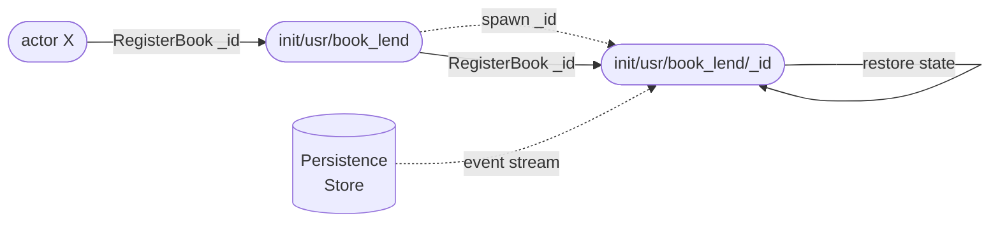

# playground-protoactor.go

> My playground I use for playing with fancy and exciting technologies. This one's for experimenting a platform actor in
> go named [protoactor](https://github.com/AsynkronIT/protoactor-go), in which actors follow DDD - Event Sourcing / CQRS principles.

## Introduction

I have a deep-rooted passion for the Actor Model. Having been a big fan and an avid admirer of the [Erlang](https://www.erlang.org) Actor system, its elegance, and efficiency in managing concurrent processes, I've always been intrigued by the power and simplicity it offers.

[Erlang](https://www.erlang.org)'s approach to concurrency, fault tolerance, and system distribution has set a high standard in the realm of Actor-based systems. Drawing inspiration from this, I've created this repository as an experimentation to explore these compelling concepts in a different landscape - the world of Go. It's a personal quest to understand how the robustness and versatility of the Actor Model can be harnessed in Go.

If you're new to the Actor Model, take a moment to read about its theory. This project isn't just about understanding the theory; it's about diving into how to use it effectively and why it's a valuable tool in building concurrent systems.

## Why the Actor Model (in Go)?

Go, with its native support for concurrency, seems like the perfect ground for experimenting with the Actor Model. The Actor Model offers an excellent abstraction, allowing us to build complex, concurrent systems in a more manageable and less error-prone way. It's about encapsulating state and behavior in actors, promoting message-driven interactions, and ensuring that our systems are scalable and maintainable.

In this repository, I'll be using the [protoactor](https://proto.actor/) library, a Go implementation of the Actor Model which provides a platform for building applications using the Actor Model. It's key features include:

- Minimalistic API - small and easy to understand and use.
- Build on existing technologies.
- Protobuf all the way for maximum performance and interoperability.
- Pluggable serialization.

## Objectives

This project aims to:

- Explore [protoactor](https://github.com/AsynkronIT/protoactor-go), a framework that brings the Actor Model to Go.
- Bring some of the concepts from the [Erlang](https://www.erlang.org) Actor Model to Go, replicating some of its elegance.
- Integrate Domain-Driven Design (DDD) principles, particularly focusing on Event Sourcing in the Actor-based systems.
- Explore persistence options for actors, including in-memory and disk-based storage, possibly using existing database systems (e.g., [PostgreSQL](https://www.postgresql.org/), [CockroachDB](https://www.cockroachlabs.com/), [MongoDB](https://www.mongodb.com/), etc.).
- Build and demonstrate a sample application to showcase the practical application of these concepts in Go.
- etc.

## Architecture

### Actor Model

An actor is a highly intelligent abstraction that provides a simplified approach to constructing complex concurrent systems. It is a protected state with only a reference available for communication through message exchanges.

Messages sent to an actor are placed in the actor's mailbox. When the actor is ready, it will consume the message. The consumption of a message can lead to:

- A change in state,
- Responding to the sender (who is also an actor) with another message,
- Altering the actor's behavior.
- Actors exist within an actor system - a hierarchical structure, akin to a tree. There will only be one actor with a given name/identifier throughout the entire actor system.

### Event Sourcing

Event Sourcing involves integrating its principles into the actor system, treating each message sent to an actor as a command. While an actor can handle all states of the domain, it's more relevant to consider a separate actor, known as an aggregate, responsible for managing the state of a domain identifier. This aggregate actor is an event-sourced actor, also referred to as a persistent actor.

In this context, events are generated from the command, representing the effect of the command. These events are then persisted. After successful persistence, they are used to change the actor’s state. The aggregate, therefore, manages the state of a domain identifier, responds to commands, and generates events. These events are sent to the actor who issued the command, and the state's persistence is achieved by consuming the Event Stream of the aggregate for the specified identifier.

#### Persistence

The persistence of the aggregate's state is achieved by storing the Event Stream of the aggregate for the specified identifier The aggregate's state is restored by consuming the Event Stream.

Besides the Event Stream, the aggregate also maintains a snapshot of its state. The snapshot is used to restore the state of the aggregate, which is then updated by consuming the Event Stream.

The supported persistence databases include:

- [bbolt](https://github.com/etcd-io/bbolt): An embedded key/value database for Go.
- `memory`: An in-memory persistence store.

##### Events

Events are stored as records in the persistence store. A record maintains the following information:

- `id`: uniquely identifies this event. It can be used for tracing and debugging purposes.
- `type`: categorizes the event. It's the name of the protobuf message that represents the event.
- `stream_id`: associates this event with a specific stream of events. It's the name of the actor that generated this event.
- `version`: represents the version of the aggregate after this event has been applied.
- `sequence_number`: is a monotonically increasing number that orders events within the same stream.
- `tags`: are optional labels or keywords associated with the event, useful for filtering or categorization.
- `storage_timestamp`: is the timestamp when this event was saved to storage.
- `metadata`: provides additional, contextual information about the event.
- `payload`: contains the detailed data of the event in a protobuf serialized form.

#### Snapshots

Snapshots are stored as records in the persistence store. A record maintains the following information:

- `id`: uniquely identifies this snaphot. It can be used for tracing and debugging purposes.
- `type`: categorizes the event. It's the name of the protobuf message that represents the entity.
- `version`: is a numeric representation of the version of the aggregate at the time of this snapshot.
- `storage_timestamp`: is the timestamp when this snapshot was saved to storage.
- `metadata`: contains additional, possibly optional, information about the snapshot, such as source or context.
- `payload`: holds the actual data of the snapshot in a protobuf serialized form.
